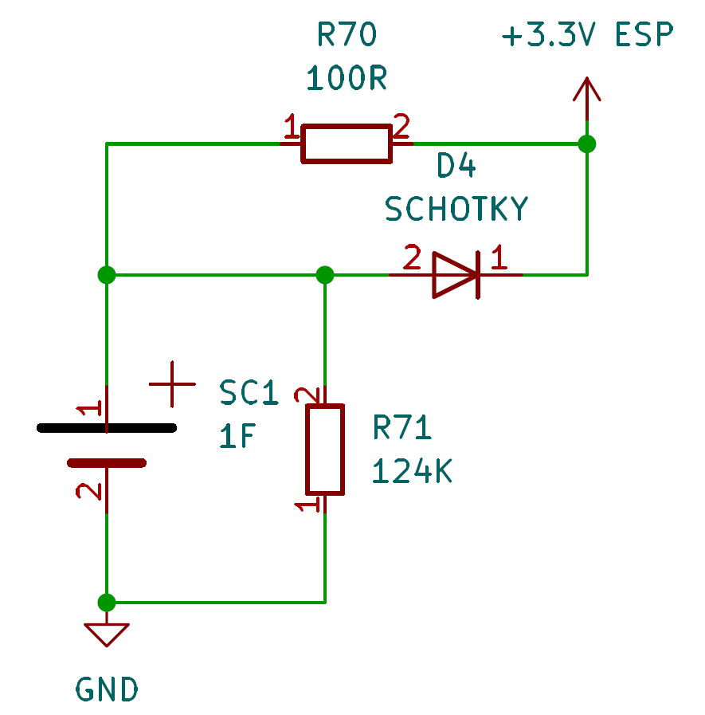
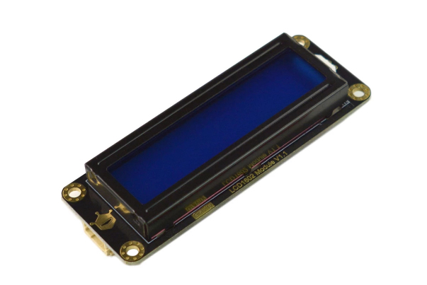
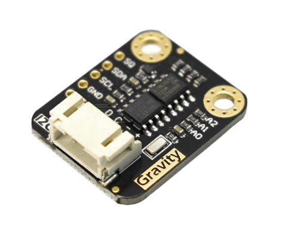
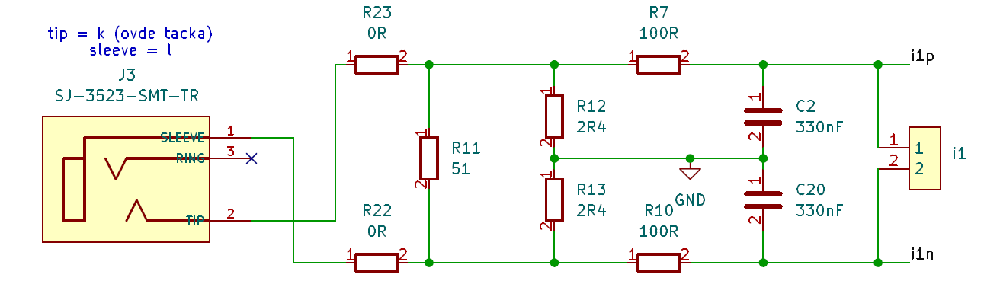
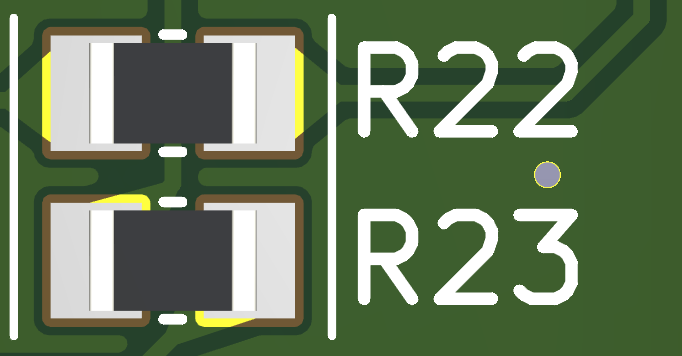
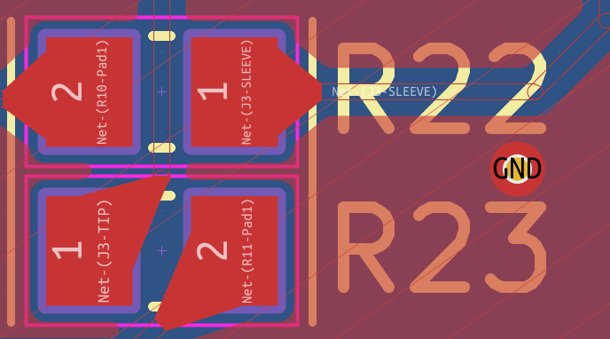
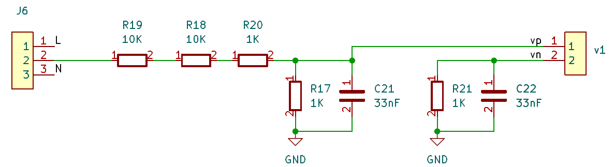

# Pregled hardvera

## Opis

Za potrebe merenja struje na sistemu se nalazi čip ATM90E26, proizvođača Microchip koji:

- zadovoljava IEC62052-11, IEC62053-21 i IEC62053-23 standard

- ima preciznost od 0.1% za merenje aktivne energije na dinamičnom opsegu 5000:1

- programibilan

Kako bi omogućili obradu podataka, neometan rad i jednostavan prenos podataka na kompjuter na strujomerku se nalazi mikrokontroler ESP32 C6, proizvođača ESSPRESIF Systems, koji nudi veliku kompjutersku moć. Izabrani mikrokontroler nudi opcije:

- Matter integracije, koja omogućava Strujomerku da se poveže na Smart Home sistem

- Veliku internu memoriju od 8Mb, koji omogućava logovanje i čuvanje do 30 000 mernih tačaka na lokalu koje se koriste za analizu rada sistema

- Jednostavnu kalibraciju mernog čipa

- Enkriptovanje i kriptografiju podataka na njemu

Kako bi uspostavili komunikaciju sa eksternim serverom, koji se može nalaziti recimo u EPSu, Strujomerko koristi Quectel M65 čip, istoimenog proizvođača koji se koristi u svrhe povezivanja Strujomerka na internet. GSM mreža, koju ovaj čip koristi, standardizovana je i koristi se globalno, korisnik može lako da ubaci SIM karticu čime omogućava razne dodatne beneficije.

## Specifikacija

### Napajanje

Da bismo omogućili neometan potrebno je obezbediti adekvatno napajanje. Strujemerko se napaja sa 7V Vacrms eksternog napajanja gde diodom ispravljamo jednu poluperiodu, filtriramo ulaznim filtrima i posle preko LDO obezbeđujemo 5V DC za potrebe ESP32 (koji upotrebom internog LDO spusta 5V na 3V3 za potrebe ATM90E26) i 4V DC koji su potrebni za rad Quectel M65 čipa. 

S obzirom da ne koristimo Grecov spoj za ispravljanje napona (zbog potencijalnih problema koje mislimo da mogu da se pojave) i niskog AC napona na ulazu, radi neometanog rada potrebno je obezbediti potrebu ulaznu kapacitivnost kako ne bismo imali pad napona koji može da nam remeti rad sistema. Kako su neki početni proračuni koji uzimaju worst case scenario pokazali da nam je potrebna ulazna kapacitivnost od skoro 10mF (Quectel M65, kao najveći potrošač na Strujomerku, na svakih 4.615ms u trajanju od 577us vuče 2A po datasheetu), na ulazu se nalazi 10mF capacitivnost +20% zbog greške računa, nepredviđenih gubitaka i manjak informacija o datom napajanju.

### Power Loss Napajanje

Strujomerko ima mogućnost da prilikom nestanka struje loguje događaj i sačuva podatke u memoriji kako ne bi došlo do gubitka podataka, i kasnije te iste podatke da pošalje na server. To je omogućeno uz pomoć internog superkondezatora kapacitivnosti 1F. 

Kolo prikazano na slici pokazuje način na koji je superkondenzator povezan u kolu. Prilikom nestanka struje ESP32 nastavlja da se napaja kratko uz pomoć superkondenzatora i preko spoljašnjeg signala registruje nestanak struje te započinje proces čuvanja podataka i slanja informacije o nestanku struje na mrežu.

Strujomerko ima specijalnu logiku koja preko komparatora omogućuje registrovanje nestanka struje.

### Čačkodugmić

Kako bi obezbedili da korisnici ne utiču na podatke ili remete adekvatan rad Strujomerka obezbeđen je Čačkodugmić. Čačkodugmić obezbeđuje da Strujomerko primeti ukoliko neko neovlašćeno pokušava da otvori kutiju strujomera i time potencijalno načini zlodelo protiv krupnog kapitala. Otvaranjem kutije procesor registruje zlodelo i javlja MUP-u (ne bukv).

### Ekran

Ekran predstavlja jednu od tri eksterne komponente na Strujomerku. Ekran prikazuje sve potrebne podatke korisniku i proizvođaču kako bi adekvatno reigstrovali potrošnju. Na ekranu se mogu pronaći redom merenja napona, struje, aktivne energije, tarife, vreme, datum, pristup mreži, greška na Strujomerku i razne druge stvari. Ekran je u LCD tehnologiji i može da prikazuje do 32 karaktera raspoređena u 2 reda. Sa ekranom se komunicira preko I2C komunikacije.

### RTC kolo

RTC kolo je druga od tri eksterne komponente na Strujomerku. RTC kolo služi kako bismo pravovremeno odragovali na promene u tarifi po kojoj se naplaćuje struja.

### Merenje Struje

Da bismo izmerili vrednost utrošene struje koristimo eksterni strujni transformator. Potrebe Strujomerka zadovoljava strujni transformator koji ima opseg do 20A. Izabrani strujni transformator unutar sebe ima integrisanu logiku koja mu daje na naponski izlaz. Da bismo očitali naponske vrednosti koristimo filtar:

Otpornici R23, R22 i R21 omogućuju limitiranje i mogu se koristiti kao naponski razdelnik strujnog transformatora. R23 i R22 otpornici se koriste i za potrebe "ukrštanja signala", tj omogućuju nam da ispravimo grešku koja može nastati pogrešnim žičenjem strujnog transformatora. Izlazni napon ulaznog filtera za merenje struje je diferencijalni signal koji ATM90E26 kasnije obrađuje.

### Merenje napona

Da bi izračunali aktivnu utrošenu snagu potrebno je znati i koji napon dobija doaćinstvo. Kako je ulazni napon koji merimo na takmičenju ograničen na 7V Vacrms potrebno je isti i skalirati. To se postiže sledećim kolom:

Vidimo da se ulazni napon skalira u odnosu 1:22 i time se dovodi bezbedni diferencijalni napon na ulaze ATM90E26.
