# Matter integracija

Matter integracija omogućava da se Strujomerko predstavi u lokalnom ekosistemu pametne kuće i da korisnik vidi relevantne podatke o uređaju kroz Matter-kompatibilne aplikacije.

## Tok uparivanja i prikaza

Slike ispod prikazuju tok uparivanja, prepoznavanje uređaja i prikaz podataka u Matter okruženju.

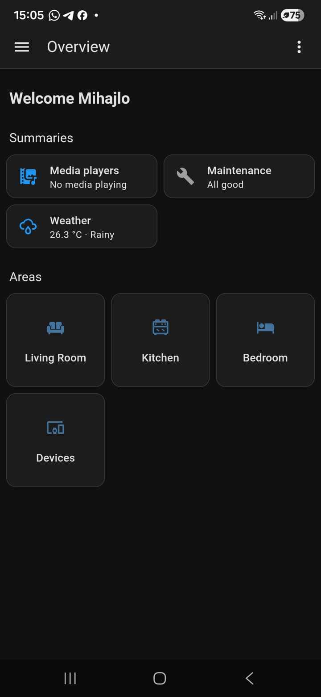
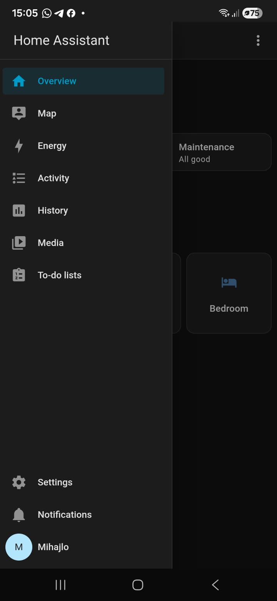
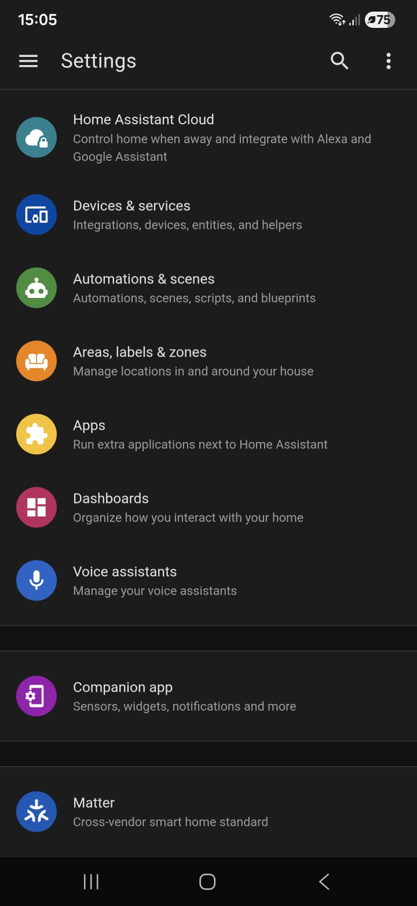
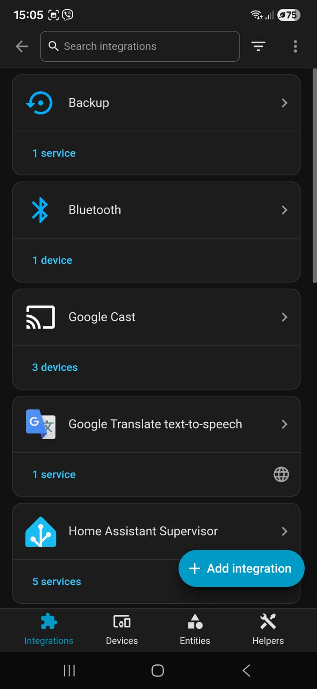
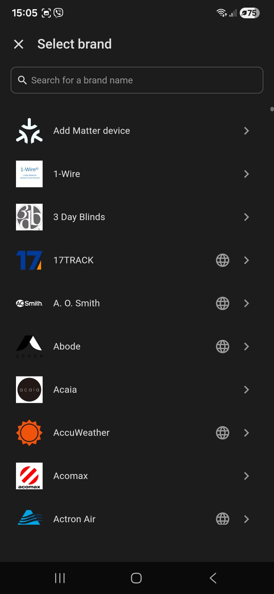
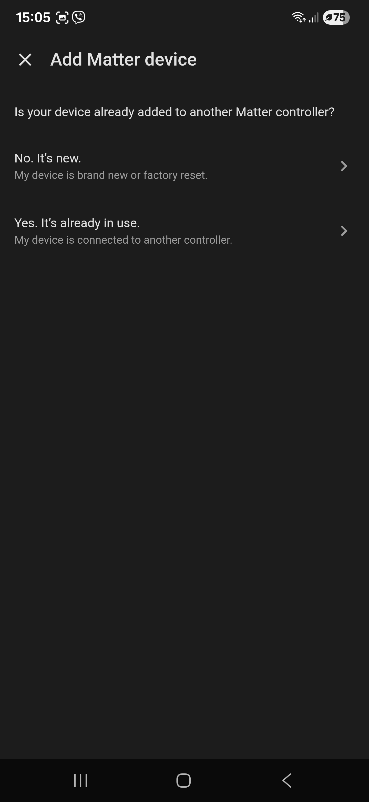
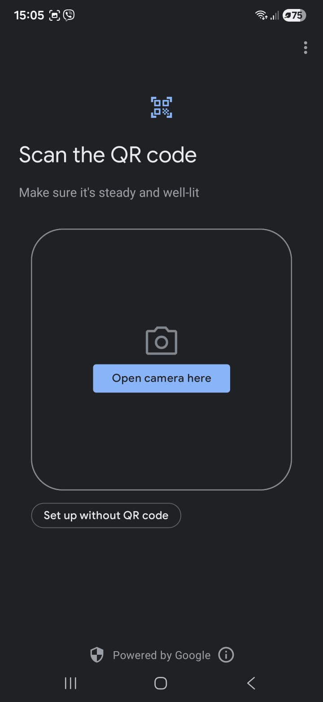
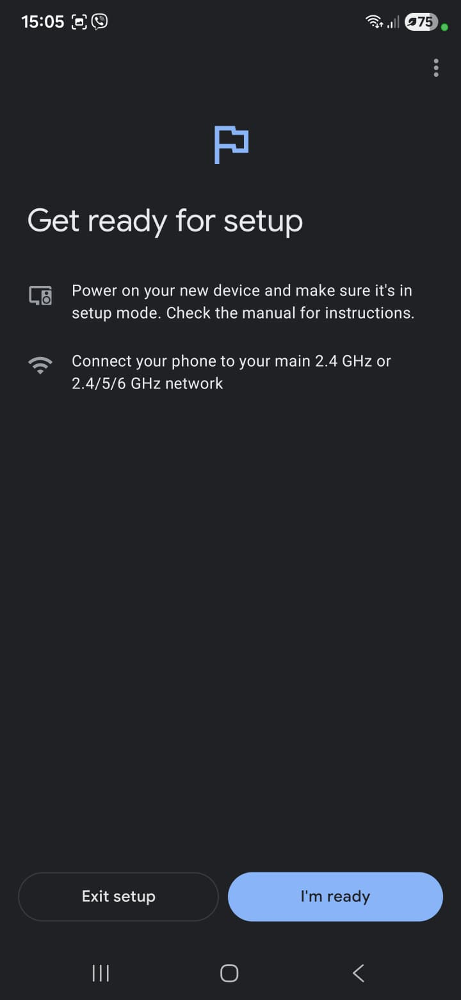
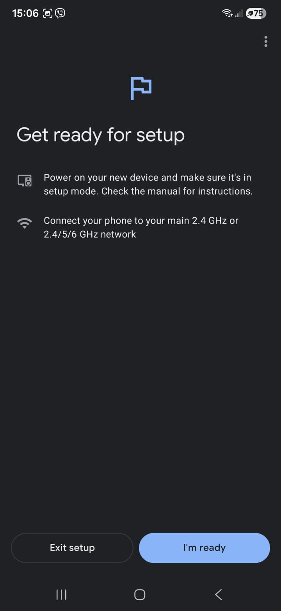
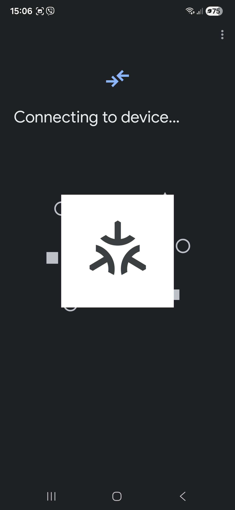
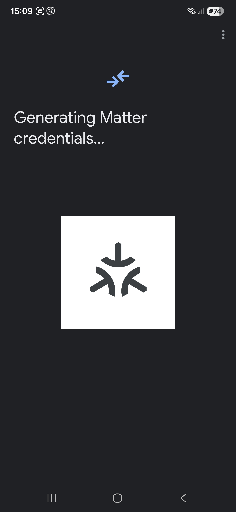
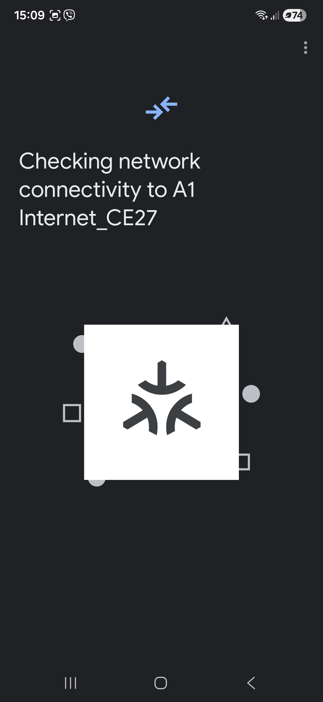
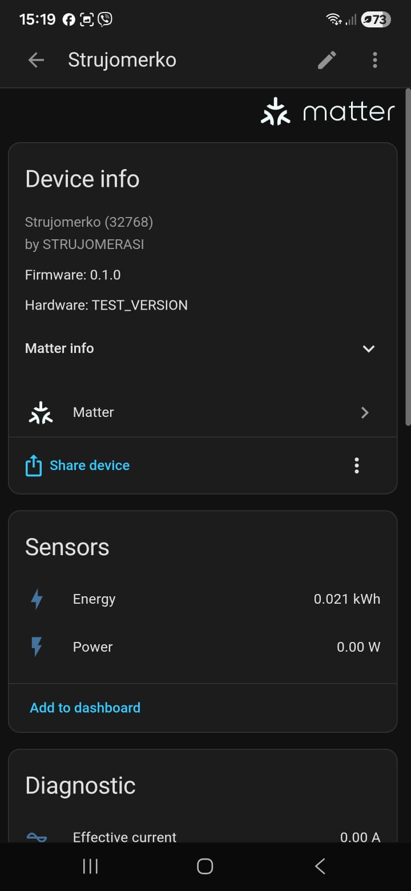
